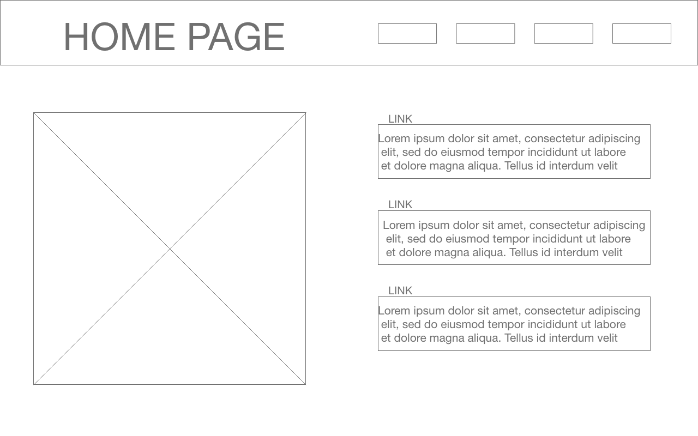
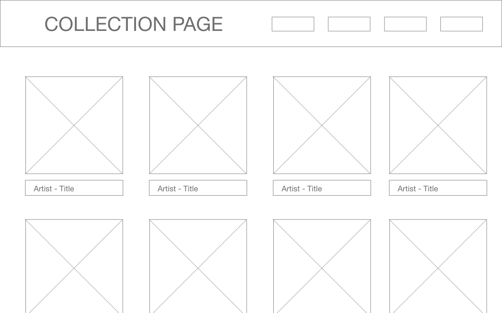
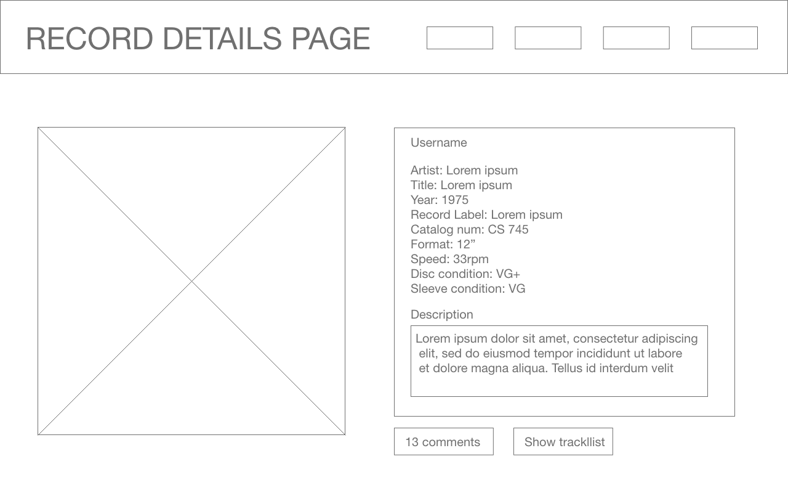
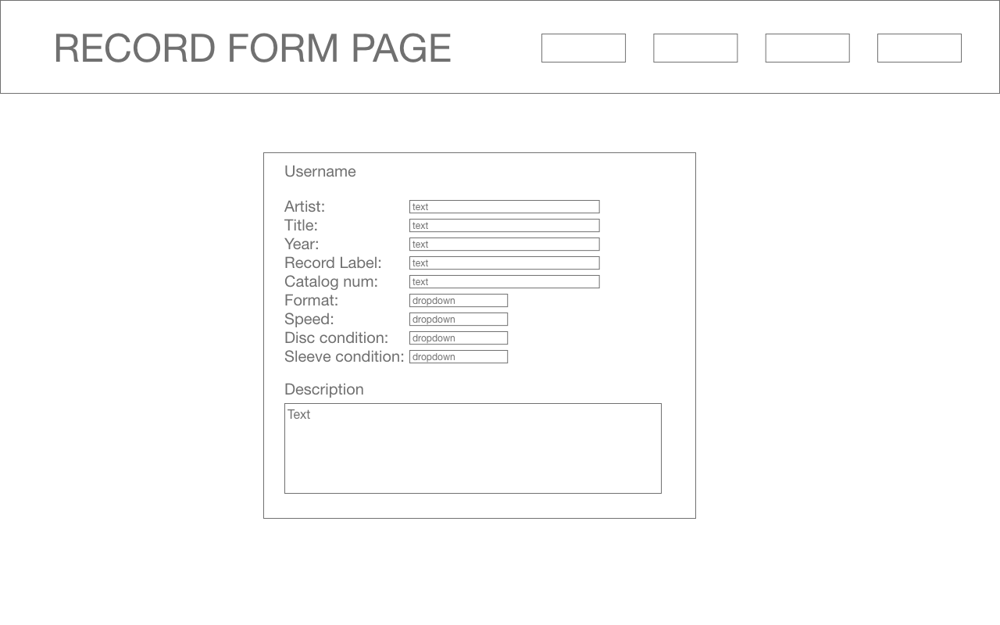
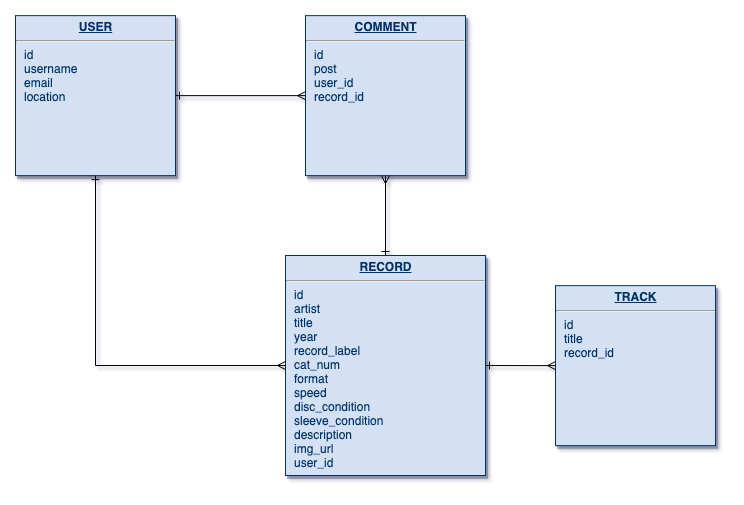

# SEI Project 4

[live site](http://recordzoo.surge.sh)

## Project Description
This is an app for collectors of vinyl records to keep track of their collection and view other users' collections. Users can create entries in their collection with album info (artist, title, etc.), pressing-specific info (catalog number, year), condition info, and an image url. Additionally, users can interact with eachother by posting comments on items in user collections.

## MVP
* Users can create an account, log in, log out
* Users can add records to their collection and update or delete them
* Users can view their own collection as well as other user’s collections
* Users can post comments on records in any user’s collection and update   or delete comments

### Post-MVP
* Users can add track listings, and add link to song (youtube, etc.)
* Add a user profile page with links to records the user has commented on
* Users can add a link to the store where they bought the record
* Use third-party API to get album info
* Use active storage to store album cover images

## Wireframes

---

---

---

---

## ERD

## React Component Hierarchy
* App
	* Home - landing page to login/register, view your collection, or view user list
	* Login/Register
		* LoginForm
		* RegisterForm
	* UsersList - list of users
  * UpdateUserInfo
  * RecordsList - list of record in one user’s collection
    * RecordForm - adds a record to your own collection
  * RecordDetails - Full details for a single record
    * TrackList - Track list for the record
    * RecordForm - Form to record edit details
    * CommentsList - Comments about the record, posted by users
      * CommentForm - For posting or editing comments

## Aditional Technologies
In addition to Rails and React, the project will use React-Router, React-Burger-Menu, and React-Modal

## Timeline
* Set up Rails back end with auth (Monday, 8/12)
* Create user components (index, show, create, edit) with full CRUD (Monday, 8/12)
* Create record components (index, show, create, edit) with full CRUD (Tuesday, 8/13)
* Create comment components (index, create, edit) with full CRUD (Tuesday, 8/13)
* Style app for desktop (Wednesday, 8/14)
* Style app for mobile (Wednesday, 8/14)
* Test deploy and debug (Thursday, 8/15)